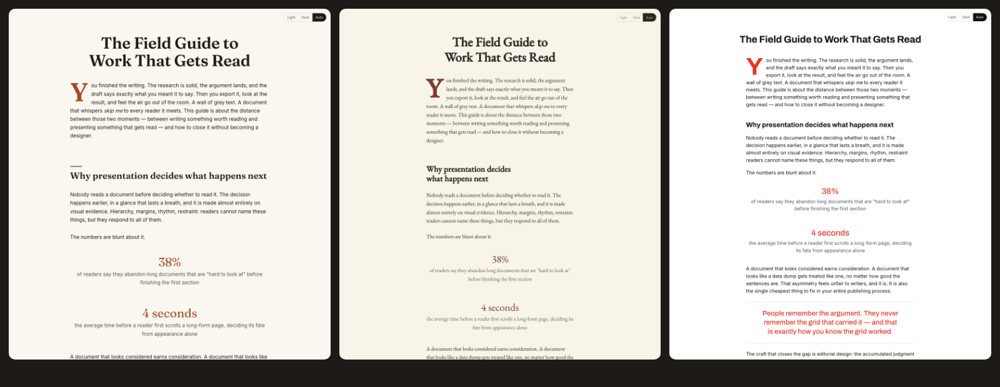

<div align="center">

# TastePilot

**Editorial Intelligence for AI agents**

The AI Art Director for written content.
Turn writing into publications worth reading.

`Markdown · HTML · URLs  →  art-directed HTML + print-ready PDF`

[tastepilot.org](https://tastepilot.org) · [Quickstart](#quickstart) · [How it works](#how-it-works) · [The Canon](#the-canon) · [Roadmap](#roadmap)

</div>

---

> **Status: v0.1.** The Publication Skilllet MVP: text/Markdown/HTML/URL ingestion, five starter Canons, the Art Direction contract, a deterministic renderer, drop caps, Light/Dark/Auto, durable artwork, Brand DNA with Preserve/Evolve/Reinvent, print/PDF composition, automated visual QA, Canon tooling, and the three-Canon demo. The Community Canon ecosystem is next — star or watch to follow along.



<p align="center"><em>One document. One set of artwork. Three Canons. <a href="https://tastepilot.org/#demo">See it live</a> or <a href="examples/demo/">inspect the output</a>.</em></p>

## What is TastePilot?

TastePilot is an art director you can drop into your agent's project folder.

Point the coding agent you already use at your writing — a Markdown file, an HTML document, or a public URL — and TastePilot turns it into a professionally art-directed, standalone HTML publication, plus a print-ready PDF edition. It works in any tool that supports the [Agent Skills open standard](https://agentskills.io): Claude Code, Cursor, Codex, Gemini CLI, GitHub Copilot, and 20+ more.

Stay exactly where you are. Add this capability to your AI.

**You write. TastePilot art-directs.** Your prose is never rewritten, summarized, or "improved" — writing is sacred here. TastePilot decides how a reader should *experience* it: typography, pacing, drop caps, pull quotes, artwork placement, whitespace, motion, and a properly composed print edition.

## Quickstart

1. Copy the `tastepilot/` folder from this repository into your project. Don't rename it.
2. Put your writing in the project.
3. Tell your coding agent — three starter recipes:

**New writing**

```text
Use ./tastepilot to make ./guide.md beautiful.
Use your recommended treatment.
Do not rewrite my content.
```

**Existing webpage**

```text
Use ./tastepilot on:
https://example.com/article

Evolve its existing visual identity.
Remove ads and site clutter.
Make it beautiful.
```

**HTML + PDF**

```text
Use ./tastepilot on ./guide.md.

Create a beautiful standalone HTML publication
and a print-ready PDF.
```

That's the whole interface. No design application to learn, no template gallery to crawl. If you supply no preferences, TastePilot recommends a treatment and proceeds:

```text
Recommended treatment:
Modern Editorial · Warm Neutral · 2 fonts · Medium Art · Gentle Motion
```

Then you steer in plain language: *Try another style. More restrained. Use warmer colors. Make the drop caps huge. Keep everything except the fonts. Export PDF.*

## How it works

**Copy folder → Point at writing → Make it beautiful.**

```text
   text · markdown · html · url
               │
               ▼
         Source Router
               │
               ▼
       Semantic Document        "What is this document saying?"
               │
               ▼
        Canon Resolver          "Which editorial grammar fits?"
               │
               ▼
      Art Direction Plan        "What deserves visual emphasis?"
               │
               ▼
     Deterministic Renderer     "Make it exactly so."
               │
        ┌──────┴──────┐
        ▼             ▼
  HTML publication   Print Composer
                      │
                      ▼
                     PDF
```

**Human taste. AI judgment. Deterministic execution.**

The AI never invents CSS. It reads your document and produces a structured, schema-validated Art Direction Plan — editorial decisions, not stylesheets. A deterministic renderer implements those decisions exactly, every time. The Canon supplies what good looks like; the AI supplies judgment about what *this* writing needs; the renderer supplies precision.

## The Canon

**We don't start from knobs. We start from canons.**

A Canon style is not a page template and not a theme. It's a reusable editorial grammar — a coherent visual language plus the rules governing *when and why* its elements should be used: layout behavior, typography relationships, paired light/dark palettes, spacing rhythm, drop-cap behavior, illustration placement, motion rules, and print adaptation.

**Don't ask AI to invent good design. Give it centuries of proven editorial grammar.**

Five starter Canons ship inside the Skilllet, so it works completely offline:

| Canon | Character |
|---|---|
| **Modern Editorial** | Confident contemporary long-form — generous whitespace, expressive drop caps |
| **Swiss Clean** | Grid discipline, restrained palette, typographic clarity |
| **Literary Classic** | Book-inspired measure and rhythm, classical ornament |
| **Technical Journal** | Structured, precise, built for tables, statistics, and process |
| **Playful Illustrated** | Illustration-forward, lighter rhythm, expressive callouts |

The starters are onboarding, not a walled garden. Canon loading is built around interchangeable sources — bundled styles, your own local styles, the community Canon, and the curated TastePilot Library — and recommendations always consider everything available to you.

**Human taste has always been cumulative. We just made it executable.**

## Not a UI-design skill

There are excellent skills that give coding agents better design judgment for building software interfaces. TastePilot is not one of them.

**They help AI design interfaces better. We help AI publish writing beautifully and consistently.**

- The input is **existing prose** — an article, guide, essay, report — not a product brief.
- Content preservation is a hard rule, not a preference.
- A **Semantic Document** sits at the core: your content has identity independent of any design, so the same words can move between Canons, languages, and mediums without loss.
- **Artwork is durable**: once created and approved, illustrations persist across redesigns instead of being regenerated.
- Output is a **reading experience** — responsive HTML *and* a genuinely composed print/PDF edition, not a screenshot.
- Art direction is **content-aware**: pacing, quiet sections, and visual emphasis follow the meaning and rhythm of the writing.

## Architecture

> **Content is permanent. Artwork is durable. Design is disposable.**

The rules the codebase is built to enforce:

1. The AI never emits CSS — it produces a schema-validated Art Direction Plan; the renderer is deterministic.
2. Source prose is never rewritten unless you explicitly ask.
3. Changing Canon never deletes or regenerates approved artwork.
4. Local output has zero remote dependency — bundled Canons work offline.
5. Exported HTML is framework-free and portable; the finished work belongs to you.
6. Community Canon data is configuration, never executable code.
7. No scroll-jacking; `prefers-reduced-motion` is respected; print output hides nothing.

Standalone HTML export is fundamental. Hosted anything is optional. **No lock-in.**

## The demo

One ~2,000-word document and one persistent set of artwork, rendered through **Modern Editorial → Literary Classic → Swiss Clean** — three radically different publications from the same words and the same assets, each with its own composed PDF edition. The build script asserts the Semantic Document and Artwork Manifest are byte-identical across all three runs.

Live at [tastepilot.org](https://tastepilot.org/#demo) · inspectable output in [`examples/demo/`](examples/demo/) · rebuilt with `pnpm demo`.

## Roadmap

**v0.1 (shipped)** — the Publication Skilllet: text/Markdown/HTML/URL ingestion, five starter Canons, Art Direction Plan contract, deterministic renderer, drop caps, Light/Dark/Auto, gentle motion, durable artwork manifest, Brand DNA extraction with Preserve/Evolve/Reinvent, print composition + PDF, automated visual QA, Canon validate/install tooling, and the three-Canon demo.

**Beyond v0.1** — the ecosystem:

- **Community Canon** — an open repository of editorial styles: submissions, forks, attribution, automated validation.
- **Certified & Library Canon** — professionally researched, print-tuned, accessibility-tested styles.
- **House Styles** — your brand's DNA, extracted once and reused everywhere.
- **Canon registry API** — versioned style delivery with local caching; the Skilllet keeps working offline. *The client ships in v0.2 (`TASTEPILOT_CANON_URL`); the service follows.*
- **Hosted publishing** — optional, never required.

**Thousands of styles can make something different. Taste knows which one to use.**

## Security model

- Canon styles are structured configuration validated against strict schemas — never executable scripts, remote prompts, or arbitrary HTML/JS.
- Ingested webpage content is sanitized; script/style/embed vectors are stripped.
- TastePilot never circumvents paywalls or authentication.
- Your documents never leave your machine unless you intentionally invoke a feature that requires it.

## License

[MIT](LICENSE) — © 2026 TastePilot.
